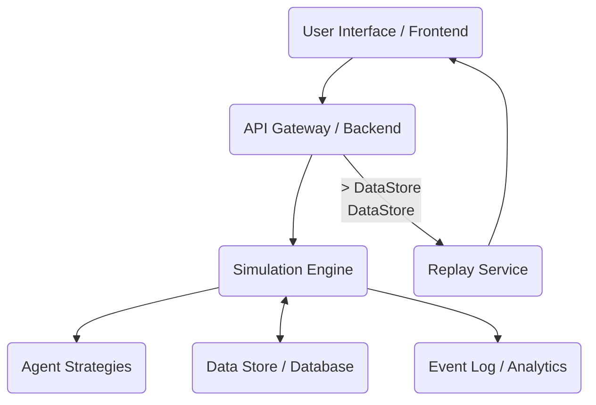

# 02_system_architecture.md — How the Machine Is Shaped

## Purpose
This document provides a mental model of the entire "Cheater's Dilemma" system, outlining its high-level architecture, major components, their responsibilities, and how data and control flow through the system. It clarifies the relationships between agents, the simulation, and the user interfaces, addressing aspects of determinism, randomness, and state management.

## Contents

### High-Level Architecture
The Cheater's Dilemma system operates on a client-server architecture, typically involving a backend simulation engine, a persistence layer (if replay functionality is enabled), and a frontend for visualization and interaction. While not explicitly mentioned in the file structure, the "contracts" aspect implies a potential integration with blockchain or smart contract logic for certain aspects of game state or rule enforcement, particularly if a decentralized version were to be explored.

### Major Components and Responsibilities

1.  **Frontend (UI/Visualization):**
    *   **Responsibility:** Provides the graphical interface for users to configure simulations, initiate runs, observe real-time simulation progress, and browse/replay past simulations. It visualizes agent states, interactions, resource levels, and emergent patterns.
    *   **Technologies (Implied by structure):** Next.js (React), potentially WebSockets for real-time updates.

2.  **Backend (API Gateway & Core Logic):**
    *   **Responsibility:** Acts as the central hub for handling requests from the frontend, orchestrating the simulation, managing game rules, and persisting data. It exposes an API for simulation control and data retrieval.
    *   **Technologies (Implied by structure):** Python (FastAPI/Uvicorn), potentially a relational database (e.g., PostgreSQL).
    *   **Sub-components:**
        *   **API Endpoints:** Handle requests for starting/stopping simulations, fetching agent data, rules, and replay data.
        *   **Simulation Service (`simulation_service.py`):** Initiates and manages the lifecycle of a simulation run.
        *   **Replay Service (`replay_service.py`):** Stores and retrieves historical simulation data.
        *   **Core Modules (`core/`):** Contains fundamental game logic, configuration management, RNG, rules enforcement, and dependency injection.

3.  **Simulation Engine (Core of the Backend):**
    *   **Responsibility:** The heart of the system. It advances the simulation through rounds, determines agent interactions based on game mechanics, updates agent states, and manages the world state.
    *   **Key Modules:** `app/domain/world.py`, `app/domain/resolver.py`, `app/core/governance.py`.

4.  **Agent Strategies (`app/agents/`):**
    *   **Responsibility:** Encapsulates the decision-making logic for different types of agents (e.g., `cheater.py`, `greedy.py`). Agents interact with the simulation engine to perform actions.
    *   **Key Modules:** `app/domain/agent.py`, `app/agents/base.py`.

5.  **Data Store / Database:**
    *   **Responsibility:** Persists simulation configurations, agent definitions, and the historical state of simulation runs for replay and analysis.
    *   **Technologies:** Likely a relational database (`app/infra/db.py`, `app/infra/repository.py` hint at this).

6.  **Optional: Smart Contracts:**
    *   **Responsibility:** (If implemented) Could be used to enforce core rules, manage a global resource pool, or register agent identities in a decentralized manner, adding an immutable layer to specific game mechanics. (Not explicitly visible in the file structure, but implied by `contracts` in the outline).

### Data and Control Flow

1.  **Simulation Setup:**
    *   User configures simulation parameters (agents, rules) via the Frontend.
    *   Frontend sends configuration to Backend API (`/simulation` routes).
    *   Backend validates and stores the configuration in the Data Store.

2.  **Simulation Execution:**
    *   User initiates simulation via Frontend.
    *   Backend's Simulation Service starts the Simulation Engine.
    *   **Simulation Loop:**
        *   The Simulation Engine iteratively calls upon active agents.
        *   Agents execute their strategies (`AgentStrategies`), deciding on actions (cooperate, cheat, form alliances, etc.).
        *   The Simulation Engine resolves interactions (`resolver.py`), applies rules (`rules.py`), updates the `World` state (`world.py`), and calculates outcomes (`outcomes.py`).
        *   Changes in state, events, and metrics are logged.
        *   Real-time updates are pushed to the Frontend (e.g., via WebSockets).
        *   Simulation state is periodically saved to the Data Store by the Replay Service.

3.  **Replay and Analysis:**
    *   User requests a past simulation replay via Frontend.
    *   Frontend queries Backend API (`/replays` routes).
    *   Backend's Replay Service retrieves historical data from the Data Store.
    *   Frontend visualizes the historical data.

### Agent ↔ Simulation Relationship
Agents are not entirely independent; they are entities *within* the simulation.
-   **Agent to Simulation:** Agents query the current world state (e.g., resources of others, history of interactions) and propose actions to the simulation engine.
-   **Simulation to Agent:** The simulation engine processes agent actions, enforces rules, resolves conflicts, and updates the agent's internal state (e.g., resources, reputation, memory) based on the outcomes. The simulation is the ultimate arbiter of truth.

### Frontend ↔ Backend ↔ Contracts
-   **Frontend ↔ Backend:** Communication is primarily via RESTful API calls for configuration and state retrieval, and potentially WebSockets for live simulation updates.
-   **Backend ↔ Contracts:** (Hypothetical, if contracts are implemented) The Backend would interact with smart contracts for critical, immutable game logic or state management that benefits from decentralization and transparency. This might involve calling contract functions to update global parameters or to verify certain agent actions.

### Determinism, Randomness, and State
-   **Determinism:** For reproducibility and research validity, the simulation aims for a high degree of determinism. Given the same initial conditions and random seed, a simulation run should produce identical results.
-   **Randomness:** While deterministic, the simulation incorporates controlled randomness (e.g., for initial agent placement, certain event triggers) using a seeded Random Number Generator (`app/core/rng.py`). This allows for exploration of probabilistic outcomes while maintaining reproducibility. The seed used for each simulation run is typically logged and can be specified.
-   **State:** The entire state of the simulation (agent positions, resources, reputations, world parameters, event history) is managed by the Simulation Engine and persisted in the Data Store. This comprehensive state allows for pausing, saving, loading, and replaying simulations accurately. Each round transitions the world from one discrete state to the next.
